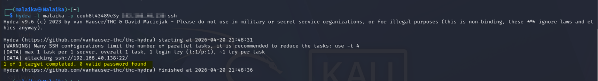
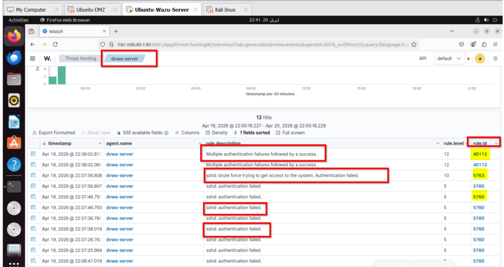

#  SOC Lab — SSH Brute Force Attack Detection & Analysis


---

## 📋 Overview

This project documents a **controlled SSH brute force attack** performed inside a home SOC (Security Operations Center) lab environment. The goal was to simulate a real-world credential-based attack, capture and analyze the resulting logs, validate detection through a deployed **Wazuh SIEM**, and produce a professional-grade incident report.

> ⚠️ **Disclaimer:** This attack was performed in a private, isolated virtual lab environment for educational purposes only. No production systems were involved.

---

## 🖥️ Lab Environment

| Role | Machine | IP Address | OS / Notes |
|------|---------|-----------|------------|
| **Attacker** | Kali Linux | `192.168.xx.xx` | THC-Hydra v9.6 |
| **Victim** | Ubuntu-DMZ (dvwa-server) | `192.168.xx.xx` | OpenSSH exposed on port 22 |
| **SIEM Monitor** | Ubuntu-Wazuh-Server | `192.168.xx.xx` | Wazuh — Threat Hunting Module |

---

## Objectives

- Simulate a realistic SSH brute force attack in a controlled lab
- Validate detection capability of the **Wazuh SIEM** platform
- Analyze authentication logs on the victim machine (`/var/log/auth.log`)
- Assess Wazuh alerting rules and their severity levels

---

## ⚔️ Attack Execution

### Tool Used
**THC-Hydra v9.6** — automated password brute forcing over SSH

### Commands Executed (from Kali Linux)

```bash
# Attempt 1 — wrong password
hydra -l malaika -p yuyry4cc43 192.168.xx.xx ssh

# Attempt 2 — correct password discovered (verbose mode)
hydra -l malaika -p xxxx ssh://192.168.xx.xx -t 1 -V
```

### Result
```
[22][ssh] host: 192.168.xx.xx   login: malaika   password: xxxx
1 of 1 target successfully completed, 1 valid password found
```

### Attack Timeline

| Time | Event |
|------|-------|
| `22:01:27` | Hydra started — first brute force attempt (wrong password) |
| `22:01:29` | Run finished — 0 valid passwords found |
| `22:01:48` | Second Hydra run launched |
| `22:01:52` | Run finished — 0 valid passwords found |
| `22:01:57` | Third run with `-V` flag — **password 'xxxx' CRACKED** |
| `22:06:43` | Fourth run — wrong password, failed |
| `22:06:48` | Final run finished |

---

## 📸 Evidence Screenshots

### 1. Hydra Attack from Kali Linux Terminal

> THC-Hydra successfully cracking the SSH password for user `malaika` on `192.168.xx.xx`

---

### 2. Wazuh SIEM — 28 Alerts Triggered

> Wazuh Threat Hunting module showing 28 security events including Level 12 critical alert

---

### 3. Auth Log on Victim Machine
 1.png)
> `/var/log/auth.log` on Ubuntu showing failed attempts followed by successful login

---

## 🔍 Authentication Log Analysis

Raw evidence from `/var/log/auth.log` on the victim machine:

```
Apr 19 10:37:25 dvwa-server sshd: Failed password for malaika from 192.168.xx.xx port 46070 ssh2
Apr 19 10:37:33 dvwa-server sshd: Failed password for malaika from 192.168.xx.xx port 53162 ssh2
Apr 19 10:37:44 dvwa-server sshd: Failed password for malaika from 192.168.xx.xx port 34738 ssh2
Apr 19 10:37:54 dvwa-server sshd: Failed password for malaika from 192.168.xx.xx port 50074 ssh2
Apr 19 10:38:01 dvwa-server sshd: Accepted password for malaika from 192.168.xx.xx port 43248 ssh2
Apr 19 10:38:01 dvwa-server sshd: pam_unix(sshd:session): session opened for user malaika
```

**Pattern observed:** Rapid sequential connection attempts from a single IP, all targeting the same username — textbook automated brute force behavior.

---

## 📡 Wazuh SIEM Detection

Wazuh generated **28 security events** in the Threat Hunting module between `21:42:20` and `22:02:20`.

| Alert Level | Rule Description | Severity |
|-------------|-----------------|----------|
| **Level 3** | PAM: Login session opened / closed | 🟢 Low |
| **Level 5** | sshd: authentication failed | 🟡 Low-Medium |
| **Level 5** | PAM: User login failed | 🟡 Low-Medium |
| **Level 10** | PAM: Multiple failed logins in a small period of time | 🟠 Medium |
| **Level 10** | sshd: brute force trying to get access — Authentication failed | 🟠 Medium |
| **Level 12** | **Multiple authentication failures followed by a success** | 🔴 **CRITICAL** |

> 🔴 **Level 12** is the most critical rule — it fires when brute force attempts are followed by a **successful login**, directly indicating credential compromise.

---

## 🧠 SOC Analysis — Key Findings

| Question | Answer |
|----------|--------|
| **Who attacked?** | Kali Linux — `192.168.xx.xx` |
| **Who was targeted?** | User `malaika` on `dvwa-server` |
| **What tool was used?** | THC-Hydra v9.6 |
| **Was it successful?** |  Yes — password `xxxx` cracked |
| **Was it detected?** |  Yes — Wazuh Level 12 alert fired |
| **Should L1 escalate?** |  Yes — successful login = escalate to L2 |
| **Severity** | 🔴 HIGH |

---

## ⚠️ Why This is HIGH Severity (not Medium)

A brute force with **no successful login** = Medium severity.

This attack had a **confirmed successful login** — meaning the attacker gained full shell access to the victim machine. In a real environment this opens the door to:

- Lateral movement across the network
- Data exfiltration
- Persistence mechanisms (backdoors, cron jobs)
- Privilege escalation attempts

**Any successful credential compromise immediately escalates to HIGH.**

---

## 🛡️ Mitigation & Recommendations

1. **Block attacker IP** via firewall rules immediately
2. **Disable password-based SSH** — use key-pair authentication only
3. **Enforce strong password policy** — minimum 12 characters, mixed complexity
4. **Enable account lockout** after 3–5 failed attempts (Fail2Ban or PAM tally)
5. **Enable MFA** for all SSH-accessible accounts
6. **Change default SSH port** from 22 to a non-standard port
7. **Configure Wazuh Active Response** to auto-block IPs on brute force detection
8. **Rotate all credentials** and conduct a full account audit

---

## 📁 Repository Structure

```
SOC-Lab-BruteForce-SSH/
│
├── README.md
│
├── reports/
│   ├── SSH_BruteForce_Incident_Report.docx      # Technical investigation report
│   └── SOC_Incident_Report_SSH_BruteForce.docx  # Job-level SOC incident report
│
├── screenshots/
│   ├── Hydra-Attack-kali 1.png                               # Hydra terminal output
│   ├── Wazu-SIEM-Alert 1.png                                 # Wazuh 28 events
│   └── Authentication-logs-evidence Victim(Ubuntu) 1.png     # Ubuntu auth.log evidence
│
└── logs/
    └── auth_log_sample.txt                       # Raw log excerpt (sanitized)
```

---

## 🧰 Skills Demonstrated

- `Threat Detection` — Identified brute force pattern via log analysis and SIEM
- `SIEM Analysis` — Wazuh Threat Hunting, rule correlation, alert triage
- `Log Analysis` — Linux auth.log parsing and interpretation
- `Incident Response` — End-to-end SOC workflow from detection to report
- `Attack Simulation` — Controlled use of THC-Hydra in an isolated lab
- `Documentation` — Professional incident report writing (job-level quality)
- `Severity Assessment` — Correctly classified attack severity based on outcome
- `Mitigation Planning` — Actionable remediation recommendations

---

## 📄 Reports

| Document | Description | Best For |
|----------|-------------|----------|
| `SOC_Incident_Report_SSH_BruteForce.docx` | Job-level incident report with full sections | LinkedIn, Interviews, Portfolio |
| `SSH_BruteForce_Incident_Report.docx` | Technical deep-dive investigation report | GitHub, Technical Review |

---

## 👤 Author

**Malaika Umbreen**
SOC Analyst — Home Lab Practitioner

[](https://linkedin.com/in/malaika-umbreen)

[](https://github.com/MalaikaUmbreen)

---

*This project is part of an ongoing home SOC lab series covering real-world attack simulation, detection, and incident response.*
